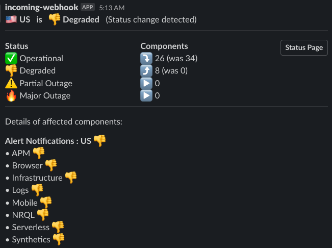

# New Relic Status Checker
Get notified in Slack when the New Relic status page changes!

This project checks the [New Relic status page](https://status.newrelic.com) for changes on a regular basis and notifies via slack when changes to the status occur. Messages are kept to a minimum and are sent only when the number of components with issues changes per category. Data can also written to New Relic as a metric or event for a historical view.

N.B. For a simpler (but more noisy and less concise) integration you could simply subscribe slack to the status RSS feed: https://status.newrelic.com/history.rss. You can also sign up for email alerts.



## AWS Lambda Setup

Some setup is required for this to work in AWS Lambda.

1. Create an S3 bucket to store data between runs
2. Create a IAM role for the lambda that has read/write access to the bucket (see below)
3. Add the role ARN to [template.yaml](template.yaml)
4. Create `event.json` and update the scheduled event payload as described below  (see [event.json.example](event.json.example))
6. Deploy the app (see below)

Role creation instructions:

Your role needs AWSLambdaBasicExecutionRole and AWSXRayDaemonWriteAccess managed policies plus the following inline policy added:

```
{
    "Version": "2012-10-17",
    "Statement": [
        {
            "Sid": "ExampleStmt",
            "Action": [
                "s3:GetObject",
                "s3:DeleteObject",
                "s3:PutObject"
            ],
            "Effect": "Allow",
            "Resource": [
                "arn:aws:s3:::YOUR-BUCKET-NAME/*"
            ]
        },
        {
            "Sid": "ListObjectsInBucket",
            "Effect": "Allow",
            "Action": [
                "s3:ListBucket"
            ],
            "Resource": [
                "arn:aws:s3:::YOUR-BUCKET-NAME"
            ]
        }
    ]
}
```

More info on role creation [here](https://repost.aws/knowledge-center/lambda-execution-role-s3-bucket) and [here](https://docs.aws.amazon.com/lambda/latest/dg/lambda-intro-execution-role.html#permissions-executionrole-console)


## Building, testing, deploying
The project is a python lambda and should be deployed using [AWS SAM cli](https://docs.aws.amazon.com/serverless-application-model/latest/developerguide/install-sam-cli.html). The deploy.sh is a helper script that pases the event from event.json to the template.

Build:
```sam build```

Deploy first time:
```
./deploy.sh -g
```

Deploy subsequent:
```
./deploy.sh -g
```
Local testing:
```sam local invoke  -e event.json StatusCheckFunction```

## Configuration options

For local testing set the values should be set in [event.json](event.json). For lambda schedule itself the same event object needs to be provided in [template.yaml](template.yaml) in the Schedule -> Input field. This has been made a little easier by allowing you to provide a variable called 'event' containing the event payload. See [deploy.sh](deploy.sh) to see how this automatically load the event and deploys, you can always run the steps individually.

The following options can be set:

- `considered_status` - A list of states that, should changes occur, you would like to be notified. e.g. `["degraded_performance", "partial_outage", "major_outage"]`
- `considered_regions` - A list of New Relic regions you care to be notified about. e.g. `["US","EU"]`
- `slack_webhook_urls` - A list of slack webhook URLs. If omitted slack messaging will be skipped.
- `s3_bucket` - Name of S3 bucket for storing last run data. e.g. "my-amazon-s3-bucket-name"
- `s3_filename` - Name of file in S3 bucket to store last run data. e.g. "latest.json"
- `nr_api_key` - A New Relic Ingest API key
- `nr_events_api` - Events API url. If omitted will be skipped. e.g. "https://insights-collector.newrelic.com/v1/accounts/YOUR-ACCOUNT-ID/events",
- `nr_metrics_api` - Metrics API url. If omitted will be skipped. e.g. "https://metric-api.newrelic.com/metric/v1"


## Query data in New Relic
If you have enabled events or metrics api then the data from the status check will also be delivered to New Relic. You can query these as follows:

- Metrics 
```
SELECT latest(nr_status_check) FROM Metric FACET status,region SINCE 24 hours AGO TIMESERIES
```

- Events
```
SELECT latest(current) from NR_Status_Checker since 24 hours ago facet region,status timeseries
```